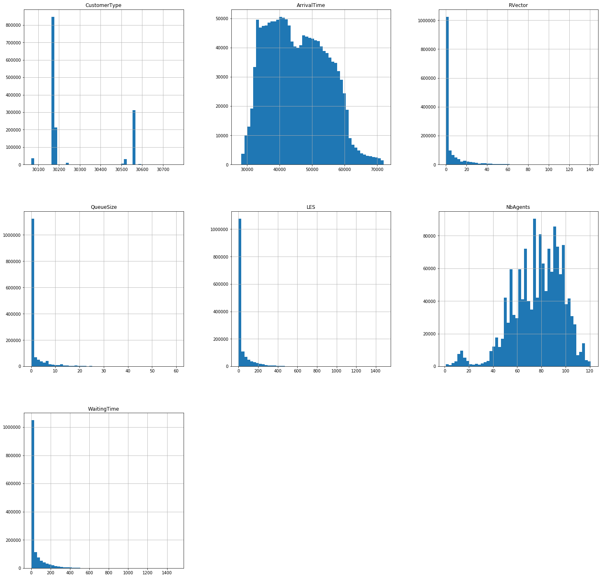

<div style="border:10px solid blue">
<h1><center>TEAM</center></h1>
<h2><center>Fallou DIAKHATE</center></h2>
<h2><center>Faty GUEYE </center></h2>
</div>

 ## `IMPORTATION DES LIBRAIRIES`


```python
import numpy as np
import pandas as pd
import matplotlib.pyplot as plt
from sklearn.model_selection import train_test_split
from sklearn.ensemble import RandomForestRegressor
from sklearn.model_selection import GridSearchCV
from sklearn.metrics import mean_squared_error
```

## `Lecture du fichier CSV`

Dans cette première partie du code nous avons utilisé la bibliothèque pandas de python pour faire une lecture du fichier final.csv qu'on a obtenue suite à notre simulation


```python
simulation_data = pd.read_csv("Data/final.csv")
```

## `EXPLORATION ET EXPLOITATION DES DONNEES`


```python
simulation_data.head()
```


<div>
<style scoped>
    .dataframe tbody tr th:only-of-type {
        vertical-align: middle;
    }

    .dataframe tbody tr th {
        vertical-align: top;
    }

    .dataframe thead th {
        text-align: right;
    }
</style>
<table border="1" class="dataframe">
  <thead>
    <tr style="text-align: right;">
      <th></th>
      <th>CustomerType</th>
      <th>ArrivalTime</th>
      <th>RVector</th>
      <th>QueueSize</th>
      <th>LES</th>
      <th>NbAgents</th>
      <th>WaitingTime</th>
    </tr>
  </thead>
  <tbody>
    <tr>
      <th>0</th>
      <td>30175</td>
      <td>29001.0</td>
      <td>0</td>
      <td>0</td>
      <td>0.0</td>
      <td>78</td>
      <td>1.0</td>
    </tr>
    <tr>
      <th>1</th>
      <td>30560</td>
      <td>29077.0</td>
      <td>0</td>
      <td>0</td>
      <td>0.0</td>
      <td>64</td>
      <td>1.0</td>
    </tr>
    <tr>
      <th>2</th>
      <td>30175</td>
      <td>29287.0</td>
      <td>0</td>
      <td>0</td>
      <td>1.0</td>
      <td>78</td>
      <td>1.0</td>
    </tr>
    <tr>
      <th>3</th>
      <td>30175</td>
      <td>29358.0</td>
      <td>0</td>
      <td>0</td>
      <td>1.0</td>
      <td>78</td>
      <td>1.0</td>
    </tr>
    <tr>
      <th>4</th>
      <td>30175</td>
      <td>29350.0</td>
      <td>0</td>
      <td>0</td>
      <td>1.0</td>
      <td>78</td>
      <td>1.0</td>
    </tr>
  </tbody>
</table>
</div>


```python
simulation_data.describe()
```


<div>
<style scoped>
    .dataframe tbody tr th:only-of-type {
        vertical-align: middle;
    }

    .dataframe tbody tr th {
        vertical-align: top;
    }

    .dataframe thead th {
        text-align: right;
    }
</style>
<table border="1" class="dataframe">
  <thead>
    <tr style="text-align: right;">
      <th></th>
      <th>CustomerType</th>
      <th>ArrivalTime</th>
      <th>RVector</th>
      <th>QueueSize</th>
      <th>LES</th>
      <th>NbAgents</th>
      <th>WaitingTime</th>
    </tr>
  </thead>
  <tbody>
    <tr>
      <th>count</th>
      <td>1.462901e+06</td>
      <td>1.462901e+06</td>
      <td>1.462901e+06</td>
      <td>1.462901e+06</td>
      <td>1.462901e+06</td>
      <td>1.462901e+06</td>
      <td>1.462901e+06</td>
    </tr>
    <tr>
      <th>mean</th>
      <td>3.026659e+04</td>
      <td>4.553522e+04</td>
      <td>5.719347e+00</td>
      <td>1.783729e+00</td>
      <td>3.666904e+01</td>
      <td>7.700996e+01</td>
      <td>3.940482e+01</td>
    </tr>
    <tr>
      <th>std</th>
      <td>1.668257e+02</td>
      <td>8.987370e+03</td>
      <td>1.301327e+01</td>
      <td>4.435977e+00</td>
      <td>7.736276e+01</td>
      <td>2.061980e+01</td>
      <td>7.995670e+01</td>
    </tr>
    <tr>
      <th>min</th>
      <td>3.006600e+04</td>
      <td>2.735000e+04</td>
      <td>0.000000e+00</td>
      <td>0.000000e+00</td>
      <td>0.000000e+00</td>
      <td>1.000000e+00</td>
      <td>0.000000e+00</td>
    </tr>
    <tr>
      <th>25%</th>
      <td>3.017500e+04</td>
      <td>3.801900e+04</td>
      <td>0.000000e+00</td>
      <td>0.000000e+00</td>
      <td>1.000000e+00</td>
      <td>6.400000e+01</td>
      <td>1.000000e+00</td>
    </tr>
    <tr>
      <th>50%</th>
      <td>3.017500e+04</td>
      <td>4.486200e+04</td>
      <td>0.000000e+00</td>
      <td>0.000000e+00</td>
      <td>1.000000e+00</td>
      <td>7.900000e+01</td>
      <td>1.000000e+00</td>
    </tr>
    <tr>
      <th>75%</th>
      <td>3.024100e+04</td>
      <td>5.256900e+04</td>
      <td>5.000000e+00</td>
      <td>1.000000e+00</td>
      <td>3.400000e+01</td>
      <td>9.300000e+01</td>
      <td>4.100000e+01</td>
    </tr>
    <tr>
      <th>max</th>
      <td>3.076400e+04</td>
      <td>7.198400e+04</td>
      <td>1.410000e+02</td>
      <td>6.000000e+01</td>
      <td>1.479000e+03</td>
      <td>1.210000e+02</td>
      <td>1.495000e+03</td>
    </tr>
  </tbody>
</table>
</div>


```python
print("SHAPE DES DONNEES DE SIMULATION >>>>>>>>>>>> "+str(simulation_data.shape))
```

    SHAPE DES DONNEES DE SIMULATION >>>>>>>>>>>> (1462901, 7)


```python
print("LES VARIABLES DES DONNEES DE SIMULATION \n\n"+str(simulation_data.keys()))
```

    LES VARIABLES DES DONNEES DE SIMULATION 
    
    Index(['CustomerType', 'ArrivalTime', 'RVector', 'QueueSize', 'LES',
           'NbAgents', 'WaitingTime'],
          dtype='object')


* CustomerType : 
* ArrivalTime : 
* RVector :
* QueueSize :
* LES :
* NbAgents :
* WaitingTime :

## `VISUALISATION DES DONNEES`


```python
simulation_data.hist(bins=50, figsize=(25,25))
plt.show()
```





## `TABLEAU DE CORRELATION`


```python
simulation_data.corr()
```


<div>
<style scoped>
    .dataframe tbody tr th:only-of-type {
        vertical-align: middle;
    }

    .dataframe tbody tr th {
        vertical-align: top;
    }

    .dataframe thead th {
        text-align: right;
    }
</style>
<table border="1" class="dataframe">
  <thead>
    <tr style="text-align: right;">
      <th></th>
      <th>CustomerType</th>
      <th>ArrivalTime</th>
      <th>RVector</th>
      <th>QueueSize</th>
      <th>LES</th>
      <th>NbAgents</th>
      <th>WaitingTime</th>
    </tr>
  </thead>
  <tbody>
    <tr>
      <td>CustomerType</td>
      <td>1.000000</td>
      <td>0.002991</td>
      <td>0.015177</td>
      <td>-0.037756</td>
      <td>0.009944</td>
      <td>-0.291312</td>
      <td>0.013598</td>
    </tr>
    <tr>
      <td>ArrivalTime</td>
      <td>0.002991</td>
      <td>1.000000</td>
      <td>-0.019300</td>
      <td>-0.003412</td>
      <td>0.105540</td>
      <td>-0.040552</td>
      <td>0.111985</td>
    </tr>
    <tr>
      <td>RVector</td>
      <td>0.015177</td>
      <td>-0.019300</td>
      <td>1.000000</td>
      <td>0.816143</td>
      <td>0.839384</td>
      <td>0.074306</td>
      <td>0.844659</td>
    </tr>
    <tr>
      <td>QueueSize</td>
      <td>-0.037756</td>
      <td>-0.003412</td>
      <td>0.816143</td>
      <td>1.000000</td>
      <td>0.748798</td>
      <td>0.171761</td>
      <td>0.750172</td>
    </tr>
    <tr>
      <td>LES</td>
      <td>0.009944</td>
      <td>0.105540</td>
      <td>0.839384</td>
      <td>0.748798</td>
      <td>1.000000</td>
      <td>0.020913</td>
      <td>0.915783</td>
    </tr>
    <tr>
      <td>NbAgents</td>
      <td>-0.291312</td>
      <td>-0.040552</td>
      <td>0.074306</td>
      <td>0.171761</td>
      <td>0.020913</td>
      <td>1.000000</td>
      <td>0.013360</td>
    </tr>
    <tr>
      <td>WaitingTime</td>
      <td>0.013598</td>
      <td>0.111985</td>
      <td>0.844659</td>
      <td>0.750172</td>
      <td>0.915783</td>
      <td>0.013360</td>
      <td>1.000000</td>
    </tr>
  </tbody>
</table>
</div>


## `SEGMENTATION DES DONNEES DE SIMULATION EN DONNEES DE TEST ET DE SIMULATION`


```python
Y = np.array(simulation_data['WaitingTime'])
```


```python
X = np.array(simulation_data.drop('WaitingTime', axis = 1))
```


```python
X_train , X_test, Y_train, Y_test = train_test_split (X, Y, random_state =0 ,train_size =0.2)
```


```python
print('Training Features Shape >>>>>>>>>>>> ', X_train.shape)
print('Training Labels Shape >>>>>>>>>>>> ', Y_train.shape)
print('Testing Features Shape >>>>>>>>>>>> ', X_test.shape)
print('Testing Labels Shape >>>>>>>>>>>> ', Y_test.shape)
```

    Training Features Shape >>>>>>>>>>>>  (292580, 6)
    Training Labels Shape >>>>>>>>>>>>  (292580,)
    Testing Features Shape >>>>>>>>>>>>  (1170321, 6)
    Testing Labels Shape >>>>>>>>>>>>  (1170321,)


## `ENTRAINEMENT DU PREDICATEUR`


```python
predicteur = RandomForestRegressor(n_estimators=2)
predicteur.fit(X_train, Y_train)
```


    RandomForestRegressor(bootstrap=True, criterion='mse', max_depth=None,
                          max_features='auto', max_leaf_nodes=None,
                          min_impurity_decrease=0.0, min_impurity_split=None,
                          min_samples_leaf=1, min_samples_split=2,
                          min_weight_fraction_leaf=0.0, n_estimators=2, n_jobs=None,
                          oob_score=False, random_state=None, verbose=0,
                          warm_start=False)


## `LES MESURES DE PERFORMANCES DU PREDICATEUR`

* LES SCORES


```python
training_score = predicteur.score(X_train, Y_train)
print("Training Score Du Predicteur >>>>>>>> "+str(training_score))
```

    Training Score Du Predicteur >>>>>>>> 0.960556072857555


```python
Y_test.reshape(1, -1)
```


    array([[1., 1., 0., ..., 1., 1., 1.]])


```python
test_score = predicteur.score(X_test, Y_test)
print("Test Score Du Predicteur >>>>>>>> "+str(test_score))
```

    Test Score Du Predicteur >>>>>>>> 0.8691253490284996


* MSE


```python
Y_predict = predicteur.predict(X_test)
mse = mean_squared_error(Y_test, Y_predict)
print("MSE >>>>>>>> "+str(mse))
```

    MSE >>>>>>>> 833.1170451386218


## `AMELIORATION DU MODELE`

* SCORE


```python
best_predicteur = RandomForestRegressor(n_estimators=50)
best_predicteur.fit(X_train, Y_train)
```


    RandomForestRegressor(bootstrap=True, criterion='mse', max_depth=None,
                          max_features='auto', max_leaf_nodes=None,
                          min_impurity_decrease=0.0, min_impurity_split=None,
                          min_samples_leaf=1, min_samples_split=2,
                          min_weight_fraction_leaf=0.0, n_estimators=50,
                          n_jobs=None, oob_score=False, random_state=None,
                          verbose=0, warm_start=False)


```python
training_score = best_predicteur.score(X_train, Y_train)
print("Training Score Du Predicteur >>>>>>>> "+str(training_score))
```

    Training Score Du Predicteur >>>>>>>> 0.9873683078402364


```python
test_score = best_predicteur.score(X_test, Y_test)
print("Test Score Du Predicteur >>>>>>>> "+str(test_score))
```

    Test Score Du Predicteur >>>>>>>> 0.9134614319683326


* MSE


```python
Y_predict = best_predicteur.predict(X_test)
mse = mean_squared_error(Y_test, Y_predict)
print("MSE >>>>>>>> "+str(mse))
```

    MSE >>>>>>>> 552.794076138522


```python

```
